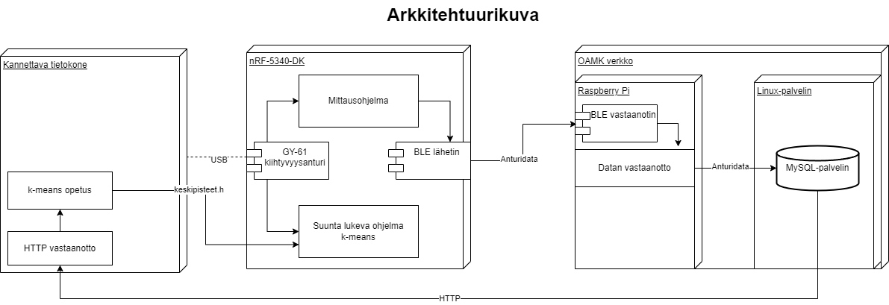
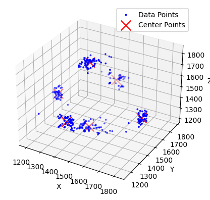
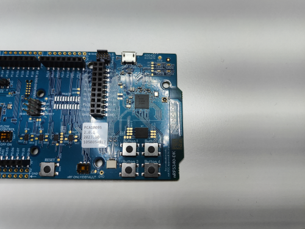
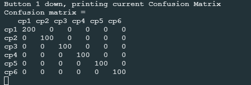

# Tietoliikenteen sovellusprojekti 2024
Tietoliikenteen ja koneoppimisen sovellusprojekti.
Projekti on toteutettu kahden hengen ryhmässä.

Antti Niiranen, Juho Sainmaa

## Projektin aihe
Projektin aiheena on luoda anturidataa käsittelevä client, välittäen dataa langattomasti reitittimelle(Raspberry Pi). Reititin välittää datan tietokantaan, josta data noudetaan ja käsitellään clientillä.
Tietokantaan luodaan TCP-rajapinta ja HTTP API. Kerättyä dataa haetaan kannettavaan koodatulla ohjelmalla ja käytetään koneoppimistarkoituksiin.

Projektissa käytetyt laitteet: nRF5340dk alustaa, Raspberry Pi(raspios_full_arm64), GY-61 kiihtyvyysanturi, kannettava tietokone.

Projektissa käytettyä ohjelmistoa: NRF Connect, VSCode, GitHub, Rufus.
  

> **KUVA 1**. Projektin arkkitehtuurikuva

## Opetusdatan kerääminen
Anturidataa kerätään nRF5340-DK-alustaa käyttäen. Alustalle on tehty koodi, joka lukee kiihtyvyysanturilta tulevaa dataa ja lähettää sen langattomasti Raspberry Pi -koneelle Bluetooth Low Energyn välityksellä. Raspberry-laitteelle on asennettu Linux-ympäristö ja laitteelle on tehty Python-ohjelma, joka tilaa ja vastaanottaa nRF5340-DK-alustan Bluetooth-lähetystä. Ohjelmalla vastaanotettu data lähetetään erillisellä Linux-palvelimella olevaan MySQL-tietokantaan, josta sitä käytetään k-means-algoritmin opetukseen.

  
## K-means algoritmin opetus
Projektissa opetetaan k-means-algoritmi tunnistamaan anturidatan osoittama suunta. Algoritmi opetetaan opetusdatalla, jota kerätään kuudesta eri suunnasta.
Tietokantaan tallennettu data haetaan Pyhthon-scriptillä, joka tallentaa datan CSV-tiedostoksi.

Opetukseen tehty ohjelma laskee kuusi satunnaista keskipistettä jokaista datapistettä kohden ja lajittelee datapisteet lähimmälle satunnaisesti arvotulle keskipisteelle.
Jokaista keskipistettä vastaava datapisteiden arvot summataan ja jaetaan keskipisteitä vastaavien datapisteiden lukumäärällä. Näin saadaan laskettua uusi keskipiste, josta lasketaan uudet keskipisteet.
Keskipisteitä lasketaan jokaisesta datapisteestä, kunnes keskipisteet eivät enää muutu. Lopulliset pisteet tallennetaan keskipisteet.h tiedostoon, mikä liitetään k-means luokittelija koodiin.

> **KUVA 2**. K-means algoritmin keskipisteet ja datapisteet.

## K-means luokittelija algoritmi
nRF5340-DK-alustan painikkeille on ohjelmoitu erilaisia toimintoja. Button 1-painikkeella tulostetaan sarjaväylälle nykyinen konfuusiomatriisi. Button 2-painikkeella nollataan nykyinen konfuusiomatriisi. Button 3-painikkeella vaihdetaan mittaussuuntaa. Debug-tilassa tehdään 100 testimittausta jokaisesta suunnasta ja tulostetaan konfuusiomatriisi. Button 4-painikkeella otetaan nykyisestä mittaussuunnasta 100 mittausta, jotka merkataan konfuusiomatriisiin.

> **KUVA 3**. nRF5340-DK painikkeet.

Luokittelija-algoritmi mittaa anturidataa opetettuihin keskipisteisiin, valiten niistä lyhyimmän etäisyyden. Tulos merkataan konfuusiomatriisiin mittaussuunnan ja tuloksen mukaisesti.

> **KUVA 4**. Konfuusiomatriisi mittaustuloksista.
